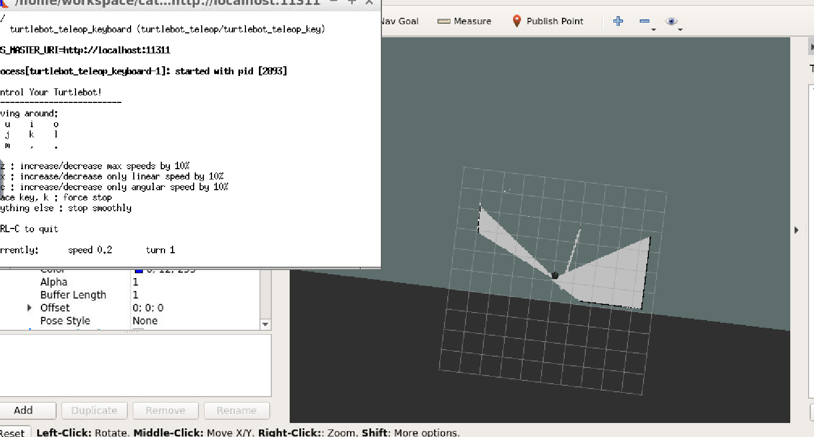
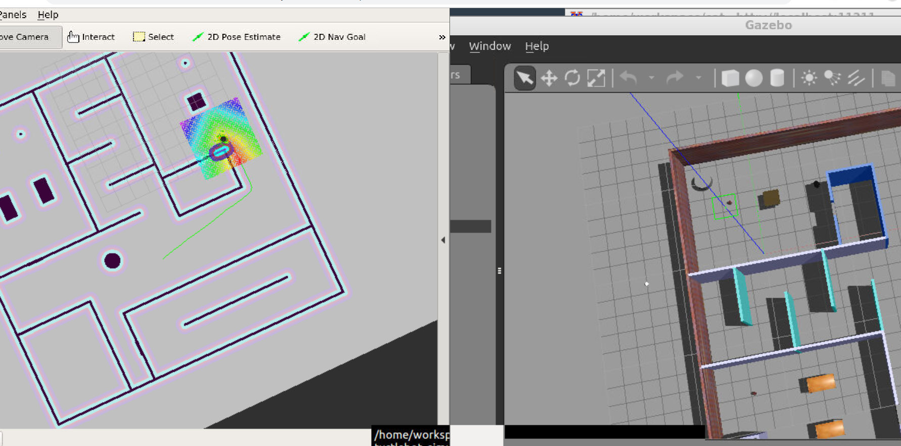
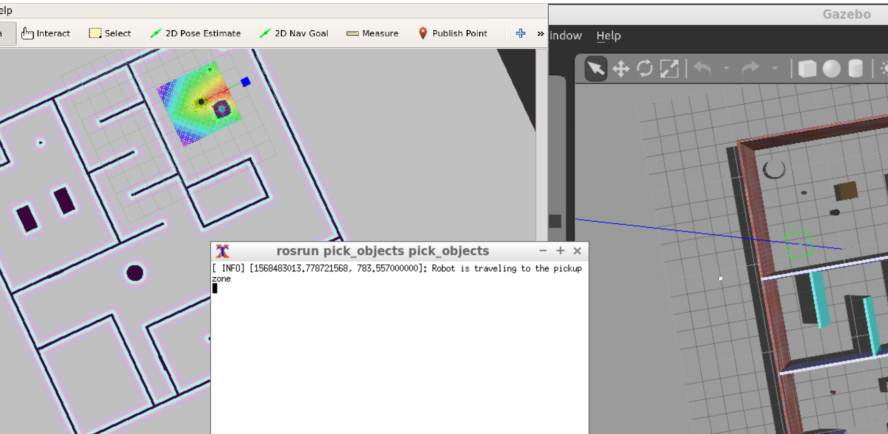
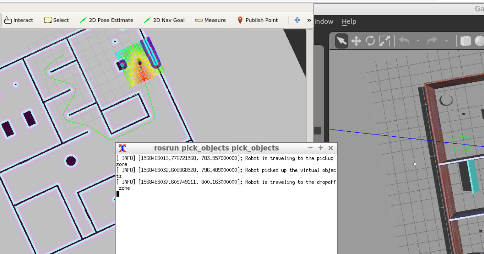
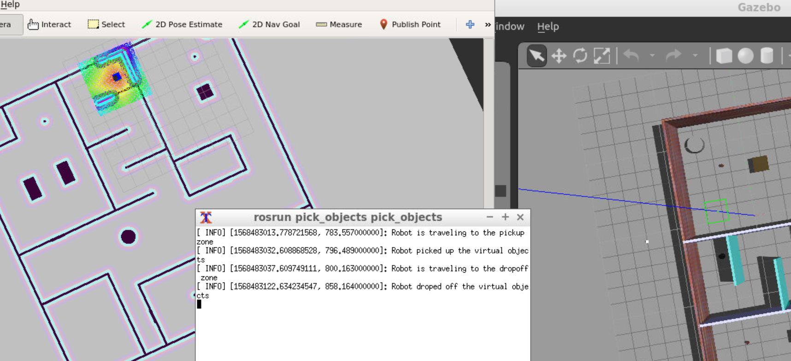

# Udacity_RoboNano_Project5
Home Service Robot

###Project
Before run `.sh`,
```
cd catkin_ws
source devel/setup.sh
cd src/Udacity_RoboNano_Project5/scripts
```
-  `./test_slam.sh`
	
-  `./test_navigation.sh`
	
-  `./home_service_robot.sh`
	
	
	

